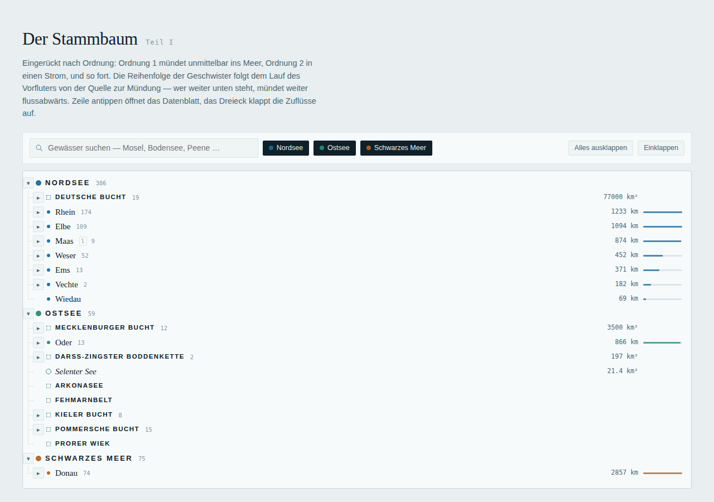
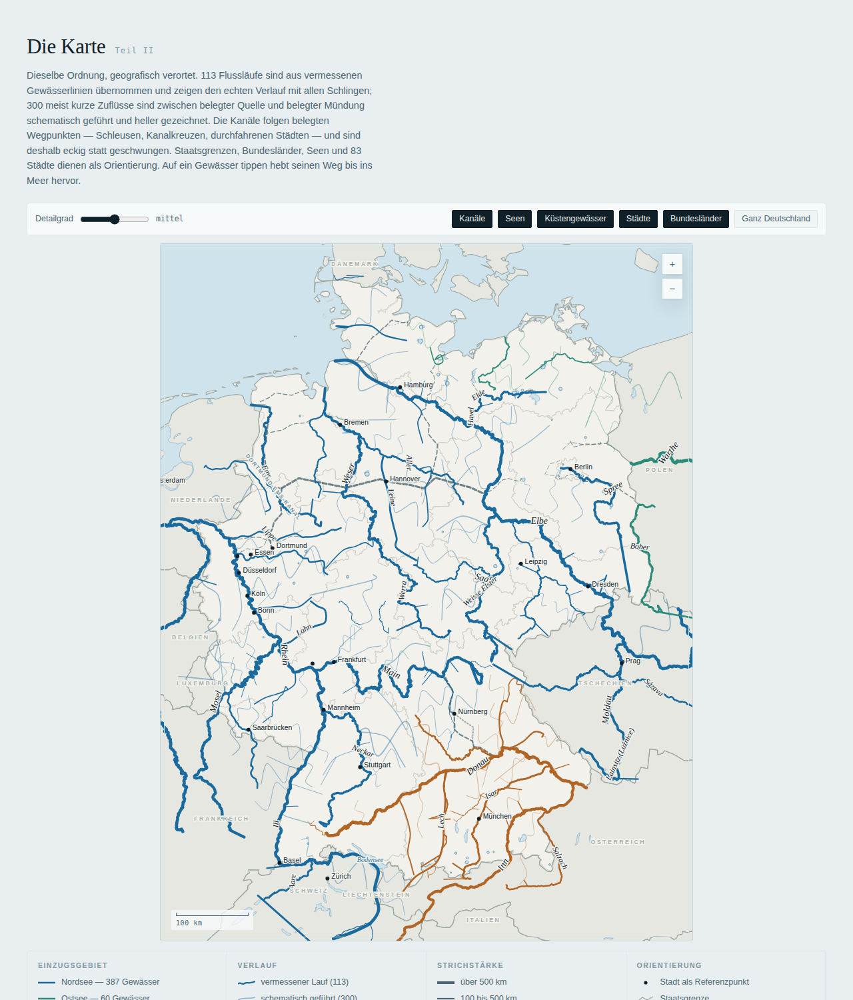
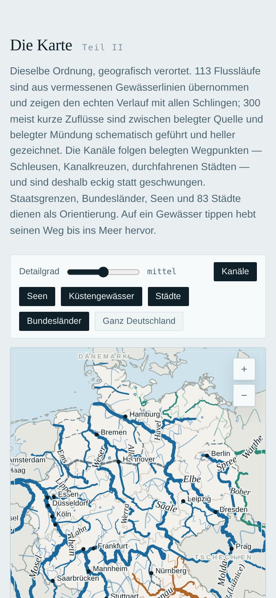

# Gewässerstammbaum Deutschland

**Every river, lake, canal and coastal water of Germany as a family tree — and the same tree on a map.**

Jeder Bach mündet in einen Fluss, jeder Fluss in einen Strom, jeder Strom in ein Meer. This
project records that lineage for 523 German waters, with three seas as the roots, and renders it
as an interactive page and an A0 poster.

| Stammbaum | Karte | Mobil |
|---|---|---|
|  |  |  |

- **Tree** — indented by order (1 = drains into the sea), siblings sorted by where they enter the
  parent from source to mouth, searchable, filterable by sea.
- **Map** — 113 river courses from surveyed river lines (GSHHG, Natural Earth), 300 shorter tributaries
  drawn schematically and visibly lighter, canals along documented waypoints, borders, lakes and
  cities for orientation. Tap a water to highlight its path to the sea.
- **Data** — one JSON record per water with length, mouth, bank, states and a one-line fact,
  checked against the German Wikipedia. Also exported as CSV.
- **Poster** — the whole tree and the map on one A0 sheet (vector PDF).

The page is a single self-contained HTML file with no dependencies, in German, light and dark mode.

## Quick start

```bash
git clone https://github.com/<you>/gewaesserstammbaum.git
cd gewaesserstammbaum
make site        # -> dist/index.html (Python 3.10+, standard library only)
make serve       # http://localhost:8000
```

Tests, poster and screenshots use a headless browser:

```bash
npm ci && npx playwright install chromium
make smoke       # browser test of the page
make poster      # -> dist/gewaesserstammbaum-a0.pdf
```

Rebuilding the geometry from the raw sources (optional, ~1 min plus downloads):

```bash
pip install -r requirements-geo.txt
make geo         # fetch sources -> base layers -> trace rivers -> geometry
```

`make help` lists all targets.

## How it works

```
data/waters/*.json  ─┐                                    ┌─► dist/index.html
data/geometry/*.json ─┼─► build_geometry ─► geometry.json ─┼─► dist/gewaesser.json, CSV
raw sources ─► prepare_base / trace_rivers ─► data/generated/ ┘  └─► build/poster.html ─► PDF
```

- `data/waters/` is the **source of truth**: hand-edited records, one per line, grouped by river
  system. Schema and conventions: [docs/DATA_MODEL.md](docs/DATA_MODEL.md).
- `data/generated/` holds pipeline outputs and is committed, so the site builds without the geo stack.
- The map geometry comes from a priority chain — documented canal routes, courses traced in the
  GSHHG river network, Natural Earth lines, and a schematic fallback. Details and the tracing
  algorithm: [docs/PIPELINE.md](docs/PIPELINE.md).

## Contributing

1. Edit or add records in `data/waters/` (any file; `make fix` moves them where they belong).
2. `make check` — must report 0 errors.
3. `make geometry` if you changed coordinates, parents or routes; commit `data/generated/geometry.json`.
4. `make site smoke` and look at the page.

CI validates the data, checks that the committed geometry is current, builds the site and runs the
browser test. Pushes to `main` deploy `dist/` to GitHub Pages (enable *Settings → Pages → Source:
GitHub Actions* once).

Working with Claude Code: [CLAUDE.md](CLAUDE.md) describes the conventions and verification steps;
`/add-water <name>` and `/check-map <id>` are project commands in `.claude/commands/`.

## Licence and sources

Code: MIT. Data: CC BY 4.0 for the curated records; river geometry from GSHHG (LGPL), base layers
from Natural Earth (public domain), state borders via deutschlandGeoJSON. See
[DATA_SOURCES.md](DATA_SOURCES.md) for attribution and caveats.
